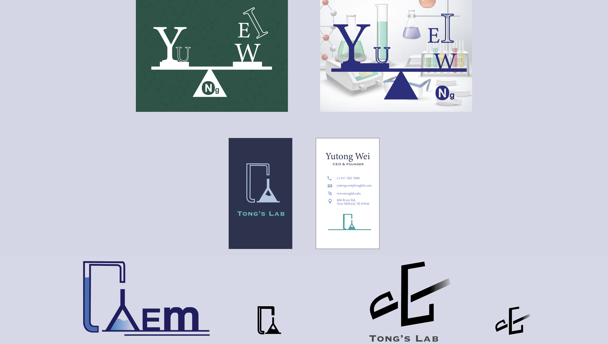
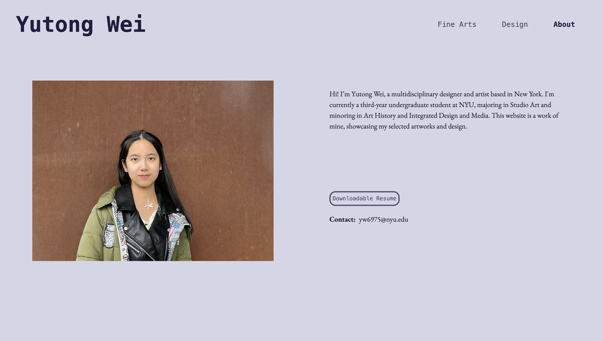

# Final Project Documentation

https://yutong-wei.github.io/  
This is my portfolio website showcases my art and design pieces.

## Screenshots

### Main page

An interactive page that allows viewers to play around with the pond and four-leaf clovers.

---

### Fine Art Page

I divided my art pieces into six sections.  
I developed from the midterm version by showing them all in the same size, which looks much more neat.

_midterm version:_

---

Layout of my works inside of each section, and add breadcrumb:

---

Provide basic info for each piece:

### Design Page

The cover image for each section is an overview of my work. When hovers on it, it shows the title and basic information while darkening the cover image.

---

Inside each design piece, shows the title, basic information, and description of the piece or project.

and layout the pieces below.

---

### About Page

The About page has the basic information about me and this website, including a downloadable resume and my contact.

## Code Snippet

I'm most proud of my main page's interactive elements. I got a good refresh on the p5.js code I made previously and fully understood everything in it by making the comments on explaining each line (refer to the comments in that file for my explanation of the coding and how it works).  
And I successfully brought it to fill my main page by setting it to be window size and used `z-index", "-1"` to make it be the bottom layer.

## Notes on:

### What you struggled with

Coding is a process going frequently between frustrated and excited. Whenever I get an idea, I need to first think of how to make it work and what methods I'm going to use. Many times it fails due to typos, missing some logic, or things just going unexpectedly. Then it's going to be the fixing parts. Sometimes it goes crazy and a lot of burnout. But finally, I made it, and very excited to see what I have in mind showing on my website.

### What you’re proud of

I'm very proud that I finally have my first portfolio website, and I built it from scratch. Three months before, I knew nothing about html and css. I can't believe how far I've come.

### What you would add next if you had more time

I'll continue to build on my portfolio website by adding new works and refine details. What I have in mind right now is adding some text on my main page to encourage users to interact with it and a very short opening quote to introduce me. And add lazy loading for my images.
