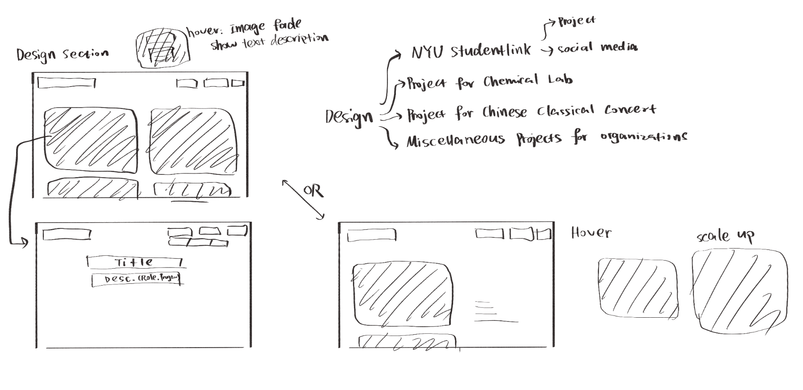
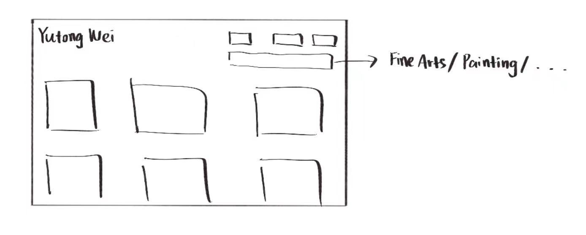

# Final Project Proposal

## Concept / Theme

Continue my portfolio website from midterm which showcases my art and design pieces.

## Visual & UX Inspiration

- https://xuecong.art/
- https://ellatang.xyz/studio/
- https://cynthiajli.xyz/carnaval

## HTML/CSS/JS Skills You Plan to Use

Navigation bar, link, box, positioning, transformation, transition, etc.

## Wireframe or Sitemap

### checklist to finish the portfolio website:

1. Comment on the p5js code and some small adjustments.
2. Finish putting up works in the "spinal serie" under Fine Arts.  
   Same layout as the "painting" section.
3. Finish putting up works for the Design page.  
   Wireframe:
   
4. Add breadcrumbs  
   Wireframe: 
5. Adjust some layout problems when viewing on the phone.  
   eg.
   - Title of "Mix Media" and "'Spinal Serie'" are not in the center.
   - Under the About section, the photo of me is stretched.
6. Want to adjust the layout of the main page under Fine Arts to make the image in the same size boxes, instead of being original ratio - looks messy

---

    Then my first portfolio will be good to send out, at least for now! :)
