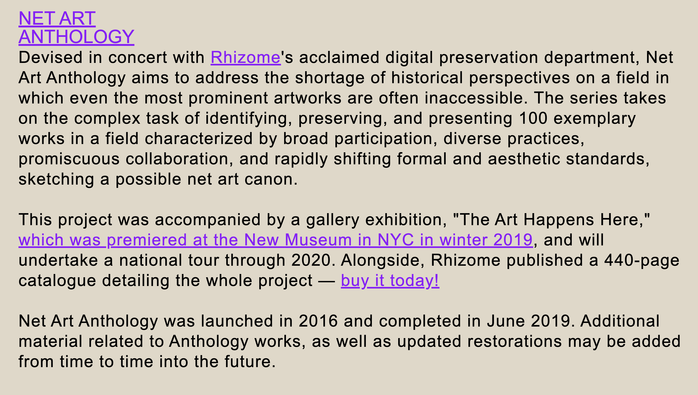

### https://anthology.rhizome.org/  
I feel the text in this website is too big and spans the entire width of the page, which makes it hard to read (though it looks better on the phone). 

And there is no navigation bar and it is not organized very well. When I am in a project and want to go back, it directs me all the way to the top and I have to scroll down to find where I was at, which is very inconvenient.

---
### https://www.art.yale.edu/
The text of this website is too small and unbalanced, leaning to the left. Inside the page, the background keeps moving and I'm hard to read the text. It said it's an experimental website and it is very cool. However, it is actually an informational website to introduce the Yale School of Art. When I was trying to apply to it a few years ago, I was hard to find any information that I was looking for. 

---
