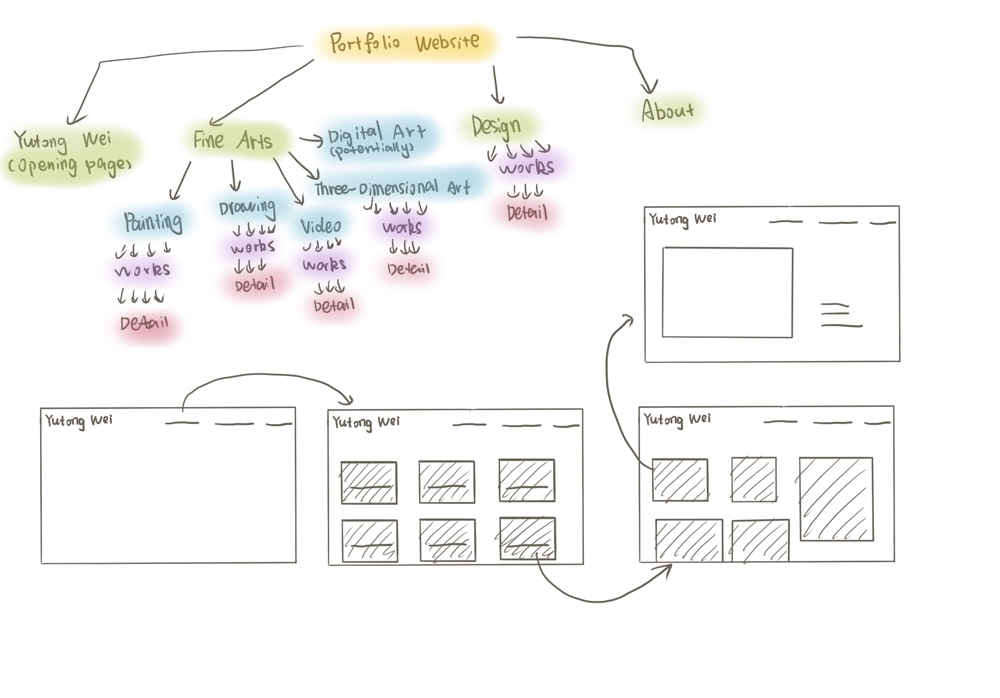

# Portfolio Website
### concept | theme of the site   
My midterm project will be my portfolio website showcasing my works of art and design. 

---
### An existing website you drew inspiration from  
- My friend's website: https://ellatang.xyz/studio/ (I think she may have built from coding)  
- My other friend's website: https://cynthiajli.xyz/carnaval/ (She showcases both fine arts and design works)

---
### Concepts | skills we have covered that you will use to build your site  
Almost every skill
- Navigation bar, link, box, positioning, transformation, transition, etc.

---
### Concepts | skills you need to still learn to complete the project
I think we learned all the basics of the skills I need, but I will need to go further from it to fit into my site.

---
### Wireframe/sitemap  

